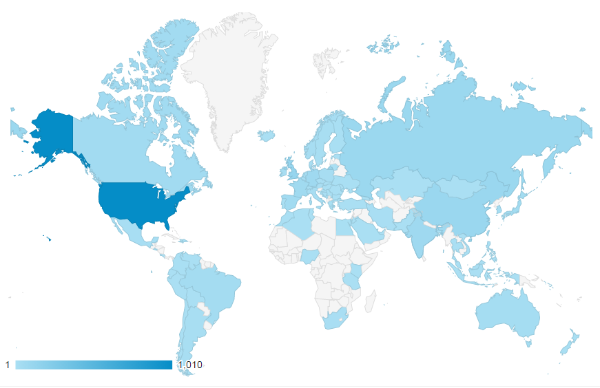

#高维临床数据在线分析平台 - hdnom

##生存分析工具箱 - hdnom
今天隆重向大家介绍一个在线的“**科学算命**”利器 [hdnom](http://hdnom.org/)  (**H**igh-**D**imensional **N**omogram)：<http://hdnom.org/>。

hdnom 是妙竹（杜克大学人群健康寿命基因组研究所博后）与全栈开发者肖楠（芝加哥大学人类遗传系博士生）搭建的简化高维临床数据分析，构建生存模型的开源平台。

 

hdnom 包括 R 包, web app, 本地 app 三部分。
 
 

它可以实现 **9 种**惩罚性变量筛选方法 [1-6]，流程化构建生存模型；nomogram 、Kaplan-Meier 生存曲线绘图；内部、外部数据验证校准；9 种不同生存模型比较；NPG, AAAS, JCO, Lancet 等顶级杂志图表绘制；在线计算器预测生存率；网页多种格式导出直接下载报告。
总之，[hdnom](https://cran.r-project.org/web/packages/hdnom/vignettes/hdnom.html) 可以省去复杂繁琐的编程过程，轻松分析高维临床数据，自动化流程化构建模型，完美实现**可重复性研究**。
 
 

这个平台的构建源自妙竹对临床研究的现状观察，身边很多医生朋友们存在处理高维临床数据分析的困扰。面对日益增加的多变量临床检测数据、基因数据，传统 Cox 生存模型无法很好解决变量之间**共线性**问题 [6]。分析高维数据对编程计算、对数理统计的要求门槛较高，而现有工具图形化界面化也不够友好。
因此，妙竹和肖楠利用一年双休日节假日中几乎所有的闲暇时间搭建了这个**开源免费**的生存率预测平台。愿景正如平台首页所述 hdnom web app <http://hdnom.io/> :
>Hiding within those mounds of data is knowledge that could ***change the life of a patient***, or ***change the world***.

他们希望能帮助更多的临床工作人员充分利用越来越丰富的高维临床数据，探索复杂疾病的致病原因、发病进程，为患者提供个体化的诊断和治疗。

Rstudio 公司将 hdnom web app 选为官网 [showcase](https://www.rstudio.com/products/shiny/shiny-user-showcase/)，赠送免费高级用户，并于2016年1月邀请两人参加[首届 Shiny 开发者大会](https://www.eventbrite.com/e/shiny-developer-conference-registration-19153967031)，在斯坦福大学做口头报告。目前全世界已有超过 **90** 个不同国家地区、**2400** 余人下载使用两人开发的建模预测工具。
 
 

现在两位开发者正积极收集不同的癌症样本，准备构建一系列的在线预测模型，目前已经在中国和美国收集到肺癌、食管癌、乳腺癌、前列腺癌等不同癌症的临床数据。
欢迎有兴趣特别是有数据在手的朋友们访问并测试这个免费的在线分析平台 hdnom web app <http://hdnom.io/> 。体验**傻瓜式**上传数据，**点击式**绘图做计算，**在线式**生成报告，在轻松愉悦中发表最新临床研究成果的乐趣。^_^

##特别鸣谢
历时一年之久，前前后后 8 次更新，整个过程中非常感谢芝加哥大学的 Matthew Stephens 教授，Samuel Volchenboum 教授，Jorge Andrade 博士，杜克大学的 Svetlana Ukraintseva 博士，印第安纳大学的程亮博士等提出宝贵改进意见。感谢 RStudio 公司的谢益辉博士，Garrett Grolemund 博士提供 shiny 高级账户技术支持。也感谢来自北京大学肿瘤医院、北京大学人民医院、北京协和医学院、上海市胸科医院、中山大学肿瘤防治中心的临床工作者们，友情进行系统测试、给予重要反馈。

##参考文献
[1] Tibshirani R: The lasso method for variable selection in the Cox model. Stat Med 16:385-395, 1997.

[2] Zhang HH, Lu W: Adaptive Lasso for Cox’s proportional hazards model. Biometrika 94:691-703, 2007.

[3] Goeman,J.J.: L1 penalized estimation in the Cox proportional hazards model. Biometrical J., 52, 70-84, 2010

[4] Simon,N. et al: Regularization paths for Cox’s proportional hazards model via coordinate descent. J. Stat. Softw., 39, 1-13, 2011.

[5] Breheny,P. and Huang,J: Coordinate descent algorithms for nonconvex penalized regression, with applications to biological feature selection. Ann. Appl. Stat., 5, 232–253, 2011.

[6] Trevor Hastie, Robert Tibshirani, Jerome Friedman. 2009. The Elements of Statistical Learning: Data Mining, Inference, and Prediction. Second Edition. February 2009. Springer Science & Business Media.

李妙竹写于杜克大学，2016年7月6日。
